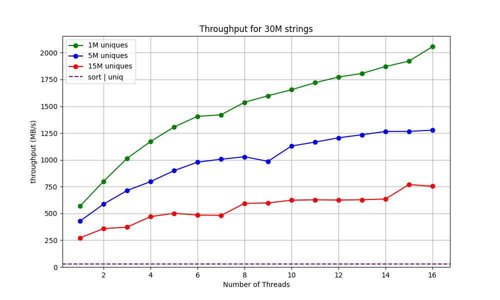

# FastUniq
`FastUniq` is a header-only library for extremely fast string deduplication using a parallelized hash table. It's possible to uniquify newline-separated strings at a speed exceeding 1 GB/s when there are a lot of duplicates (see the "Benchmark" section for detail).

`sort <input file> | uniq` is often used as a one liner for string deduplication. 
But if your goal is only deduplication and you don't need a sorted output, you can go much faster! 
In this repository, we investigate how much faster a string uniquifier that implements the following optimization can be than `sort <input file> | uniq` :

- Parallelized hash table that scales well with the number of threads
- Fast hash function using SSE/AVX2
- Batching hash calculation and insertion into hash table
- Prefetching for hash table accesses

**Note that `FastUniq` cannot uniquify two strings which have same hash values.** Since 64-bit hash is used, the chance of two strings having same hashes is very low, but not zero. See "Probability of hash collision" section for detail.
## How to use `FastUniq` in your program
In order to use `FastUniq` in your program, include `FastUniq.hpp` and give `-mavx2, -maes, -fopenmp` flags to your compiler when compiling the program. For maximum performance, it's recommended to give either `-O3` or `-Ofast`.

Example: 
```
g++ your_program.cpp -mavx2 -maes -O3 -fopenmp
```
## Benchmark
The following graph shows the results of performance measurements with the number of strings fixed at 30 million and with different numbers of threads. 



The benchmark was performed on a machine with a Ryzen 5825U CPU (8 cores, 16 threads) and 16GB of RAM. Maximum length of a string is 30. 

We can see the following performance characteristics from the graph.

- The performance with 16 threads is found to be approximately three to four times faster compared to single-thread performance.
- The performance degrades as the number of unique strings increases.
    - This is likely due to the fact that the number of insertions into the hash table increases as the number of unique strings increases. Insertion into a hash table requires exclusive access to a bucket and other threads should wait for that insertion, which negatively impacts performance.
- FastUniq is constantly faster than `sort | uniq` even when single threaded.
